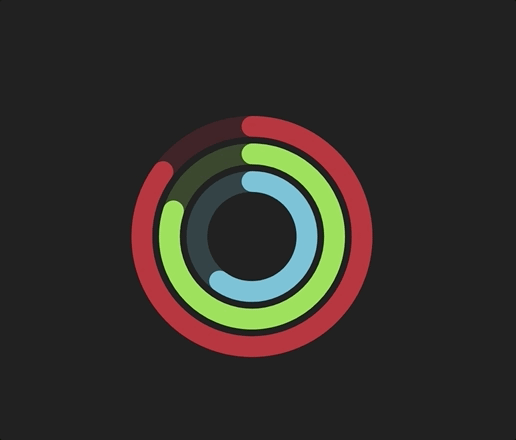

# SVG Activity Ring
> Development of an activity ring

## Table of Contents
* [Technologies Used](#technologies-used)
* [Preview](#preview)
* [Project Status](#project-status)
* [Room for Improvement](#room-for-improvement)
* [Contact](#contact)

## Technologies Used
- html
- scss

## Preview

## Project Status
Project is: _complete_ 

## Room for Improvement
To do:
- Pick color for each ring
- Set percentage for each ring

## Contact
Created by [@leonardolucascs] - feel free to contact me!
